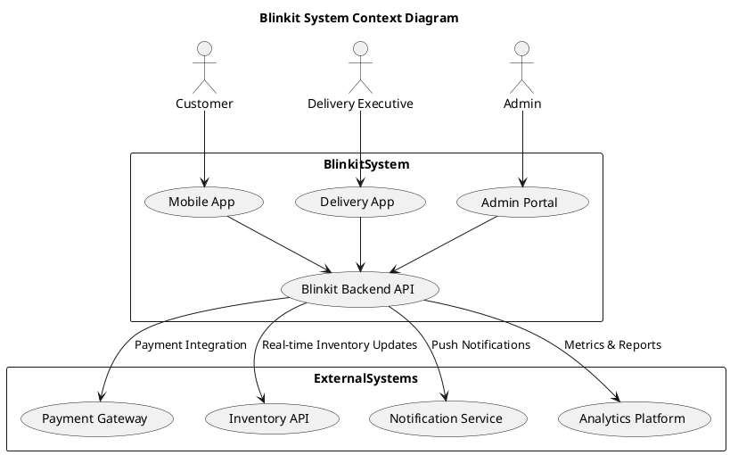
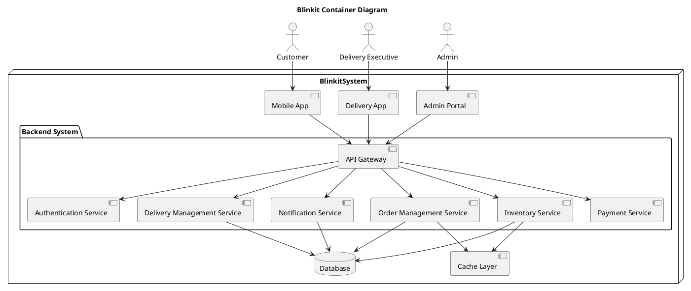
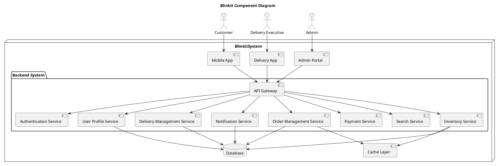
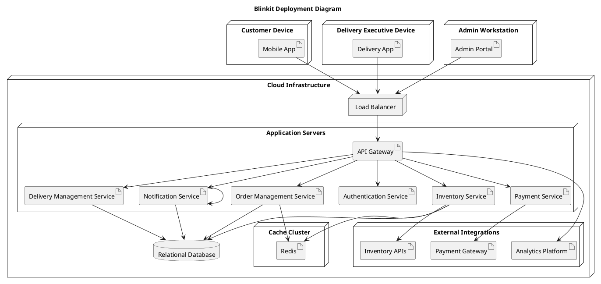

# Blinkit System Architecture Documentation 

# System Context Diagram 

The **System Context Diagram** provides a high-level view of the Blinkit system and its interactions with external actors and systems.

## Elements

### Actors:
- **Customer**:  
  Interacts with the Blinkit system via the **Mobile App** to browse, order, and track groceries.

- **Delivery Executive**:  
  Uses the **Delivery App** to manage and fulfill deliveries.

- **Admin**:  
  Uses the **Admin Portal** to oversee operations and manage the system.

### System Boundary:
- **Blinkit System**:  
  The central system comprising apps for customers, delivery executives, and admins, which communicate through the **Blinkit Backend API**.

### External Systems:
- **Payment Gateway**:  
  Processes payments securely.

- **Inventory API**:  
  Provides real-time updates of product availability.

- **Notification Service**:  
  Sends push notifications to users.

- **Analytics Platform**:  
  Generates reports and insights for system analysis.

## Flow:
1. **Actors and Applications**:  
   - **Customers** use the **Mobile App**.  
   - **Delivery Executives** use the **Delivery App**.  
   - **Admins** use the **Admin Portal**.

2. **Backend Communication**:  
   All apps communicate with the **Blinkit Backend API**, which handles requests and integrates with external systems:

   - **Payment Gateway**: For processing payments.  
   - **Inventory API**: For real-time inventory updates.  
   - **Notification Service**: For sending push notifications.  
   - **Analytics Platform**: For generating reports and insights.

# Container Diagram 

The **Container Diagram** details the main containers (applications, services, and databases) within the Blinkit system and their interactions.

## Elements

### Containers:
- **Mobile App**:  
  For customer interactions (browsing, ordering, tracking).

- **Delivery App**:  
  For delivery executives to manage deliveries.

- **Admin Portal**:  
  For administrative tasks like inventory and order management.

### Backend System:
- **API Gateway**:  
  Central entry point for requests to various backend services.

- **Authentication Service**:  
  Manages user authentication and authorization.

- **Order Management Service**:  
  Handles orders, from creation to fulfillment.

- **Inventory Service**:  
  Manages product availability and stock updates.

- **Delivery Management Service**:  
  Oversees delivery logistics.

- **Notification Service**:  
  Sends notifications for updates or alerts.

- **Payment Service**:  
  Manages payment processing.

### Storage:
- **Database**:  
  Stores persistent data related to orders, inventory, users, etc.

- **Cache Layer**:  
  Improves performance with faster data access (e.g., Redis).

## Flow:
1. **Frontend Communication**:  
   - The **Mobile App**, **Delivery App**, and **Admin Portal** communicate with the **API Gateway**.

2. **Routing Requests**:  
   - The **API Gateway** routes requests to the appropriate backend services:
     - **Authentication Service** for authentication.  
     - **Order Management Service** for order processing.  
     - **Inventory Service** for stock updates.  
     - **Delivery Management Service** for delivery logistics.  
     - **Notification Service** for sending notifications.  
     - **Payment Service** for payment processing.

3. **Data Storage**:  
   - Backend services interact with the **Database** to store and retrieve data.  
   - The **Cache Layer** (e.g., Redis) is used to improve performance with faster data access.

# Component Diagram

The **Component Diagram** drills down into the individual components of the backend services and their responsibilities.

## Elements

### Additional Components:
- **Search Service**:  
  Enables search functionality for customers to find products.

- **User Profile Service**:  
  Manages customer and delivery executive profiles, including account details and preferences.

### Interactions:
1. **Frontend Communication**:  
   - The **Mobile App**, **Delivery App**, and **Admin Portal** interact with the **API Gateway**.

2. **Routing Requests**:  
   - The **API Gateway** routes incoming requests to the appropriate backend services:
     - **Authentication Service**: Handles login and authorization processes.
     - **Order Management Service**: Processes orders, from creation to fulfillment.
     - **Inventory Service**: Manages stock availability and updates.
     - **Delivery Management Service**: Oversees delivery logistics and status updates.
     - **Notification Service**: Sends alerts and notifications to users.
     - **Payment Service**: Manages payment processing and transactions.
     - **Search Service**: Handles product search and querying.
     - **User Profile Service**: Manages user profile information for customers and delivery executives.

### Data Storage:
- **Database**:  
  Stores persistent data related to:
  - Orders  
  - Inventory  
  - Deliveries  
  - User Profiles

- **Cache Layer** (e.g., Redis):  
  Supports quick data retrieval for frequent queries, improving system performance.

## Flow:
1. **Frontend Apps** communicate with the **API Gateway**.
2. The **API Gateway** routes requests to various backend services based on functionality.
3. Backend services interact with the **Database** for storing and retrieving persistent data.
4. The **Cache Layer** is used to optimize access to frequently queried data.

# Deployment Diagram

The **Deployment Diagram** shows how the Blinkit system is deployed across various hardware and infrastructure nodes.

## Elements

### Nodes:
- **Customer Device**:  
  Runs the **Mobile App**.

- **Delivery Executive Device**:  
  Runs the **Delivery App**.

- **Admin Workstation**:  
  Hosts the **Admin Portal**.

### Cloud Infrastructure:
- **Load Balancer**:  
  Distributes incoming traffic across multiple **Application Servers** to ensure scalability and reliability.

- **Application Servers**:  
  Host the following backend services:
  - **API Gateway**: Central entry point for handling requests.  
  - **Order Management Service**: Manages the creation and processing of orders.  
  - **Inventory Service**: Handles product availability and stock updates.  
  - **Delivery Management Service**: Oversees the logistics of deliveries.  
  - **Authentication Service**: Manages user login and authentication.  
  - **Notification Service**: Sends alerts and notifications.  
  - **Payment Service**: Processes payments securely.

### Storage and Cache:
- **Relational Database**:  
  Centralized database for storing persistent data related to:
  - Orders  
  - Inventory  
  - Deliveries  
  - Users  

- **Cache Cluster (Redis)**:  
  Provides fast access to frequently used data, improving performance and reducing database load.

### External Integrations:
- **Payment Gateway**:  
  Processes payment transactions securely.

- **Inventory APIs**:  
  Provides real-time updates of product stock.

- **Notification Service**:  
  Sends push notifications and alerts to users.

- **Analytics Platform**:  
  Generates reports, insights, and metrics for system analysis.

## Flow:
1. **Frontend Communication**:  
   - The **Mobile App**, **Delivery App**, and **Admin Portal** send requests to the **Load Balancer**.

2. **Traffic Routing**:  
   - The **Load Balancer** distributes requests to the **API Gateway** on the **Application Servers**.

3. **Backend Processing**:  
   - The **API Gateway** routes requests to the appropriate backend services for processing.

4. **Data Storage**:  
   - Backend services interact with the **Relational Database** to store and retrieve persistent data.  
   - The **Cache Cluster (Redis)** provides quick data retrieval for frequently accessed data.

5. **External Integrations**:  
   - Backend services connect to external systems like:  
     - **Payment Gateway** for processing payments.  
     - **Inventory APIs** for real-time stock updates.  
     - **Notification Service** for sending alerts.  
     - **Analytics Platform** for generating reports.

